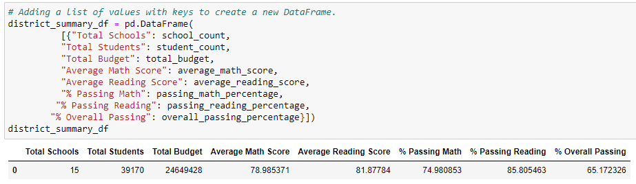
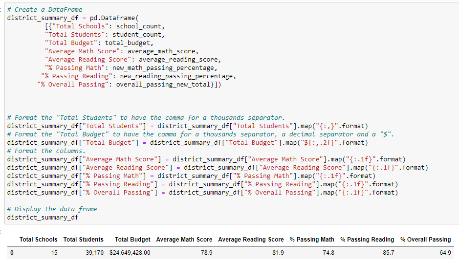
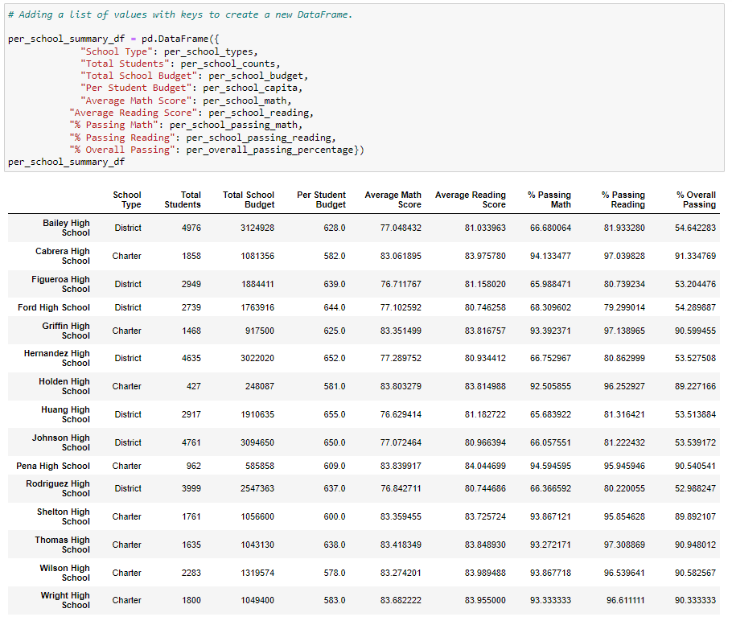
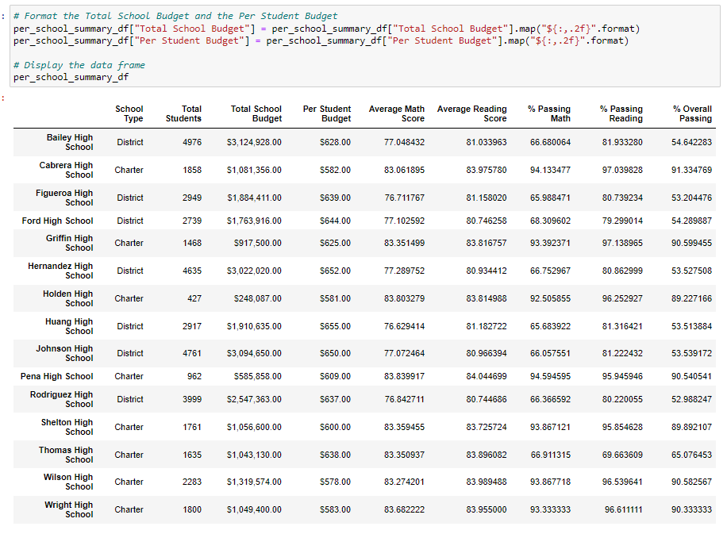

# school_district_analysis
---
## Overview of the School District Analysis
The purpose of this project was to clean up the data for the students_complete.csv file to change the reading and math grades for the Thomas High School ninth graders, and see how this would alter other dataframes and summaries for the rest of the analysis. 
---
## Results
The district summary images below show the old summary table compared to the new summary table after taking out the Thomas High School ninth grade reading and math scores. The new summary shows that the passing percentages for % Passing Math, % Passing Reading, and % Overall Passing went down slightly. Thomas High School's performance only affected the table by a small percentage. This is actually logical considering that there were 15 high schools overall and four grade levels in each of those schools, and we only altered the data for one grade in one of the fifteen schools. 

In comparing the school by school analysis, we can see the change a bit more drastically here. Removing the 9th grade data here showed a bigger change because now we are seeing one-fourth of the data being affected for Thomas High School itself. As we can see with these images, the % Overall Passing went from about 90.94% to about 65.08%. This is a much bigger identifiable shift in the scores. Thus, it would be better to then continue the analysis with regards to the remaining 10th, 11th, and 12th grade data alone, which we put as a new variable.

---
## Summary
Further analysis of the scores were evaluated by spending, size, and type of school.
### Spending
The results show that the schools with the lowest spending ranges (<$586) actually had a higher score in every category compared to the more expensive spending ranges per student - average math scores, average reading scores, % passing math, & passing reading, and % overall passing were all elevated for the lowest spending range. 
### Size
The results show that the small and medium sized schools did similarly well in all the categories. The large schools, however, displayed lower stats across the board for these categories, with the most drastic being that the overall passing percentage went from 90-91 percent in the small and medium sizes, respectively, to 58% in the large school size. 
### Type
The results show that Charter schools did significantly better than District schools in the % Passing Math and % Overall Passing categories, and moderately better in the % Passing Reading category, and similarly in the average math and average reading score categories. 
